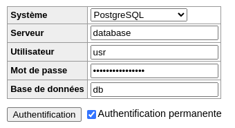

# CPE-DevOps
DevOps at CPE Lyon

> Ennoncés TP : http://school.pages.takima.io/devops-resources/

Name : Alexis Carella

- [tp1-docker](#tp1---docker)
  - [docker-compose avec les build](tp1-docker/docker-compose.yml)
  - [docker-compose avec les images docker hub](tp1-docker/docker-compose-gh.yml)
- [tp2-pipelines](#tp-2---pipelines-avec-github-action)
  - [push.yaml pipeline](/home/alexis/school/CPE-DevOps/.github/workflows/push.yml)
  - [tests.yml pipeline](/home/alexis/school/CPE-DevOps/.github/workflows/tests.yml)
- [tp3-ansible](#tp3---ansible)
  - [playbook.yml](tp3-ansible/playbook.yml)
  - [inventories](tp3-ansible/setup.yml)

# TP1 - Docker

## Database

```Dockerfile
FROM postgres:14.1-alpine

ENV POSTGRES_DB=db \
   POSTGRES_USER=usr \
   POSTGRES_PASSWORD=pwd
```

```bash
docker build -t tp1-database database
docker network create app-network
docker run -d \
    --name database \
    --network app-network \
    -e POSTGRES_PASSWORD="SecretPassword1!" \
    -v database:/var/lib/postgresql/data \
    tp1-database

docker run -d \
    --name adminer \
    --network app-network  \
    -p "8080:8080" \
    adminer:4.8.1
```



## Hello World API

Commandes :
```bash
docker build -t backend-api backend
docker run -d \
    -p "8081:8080" \
    backend-api
```

L'interêt de faire un multistage build est d'obtenir une image plus légère. Elle ne contient pas toutes les dépendances néscessaire pour compiler le code.

Elle ne contient pas non plus le code source inutile à l'exécution de l'application, en cas de fuite de l'image, le code source n'est pas divulgué.

```Dockerfile
# Build
FROM maven:3.8.6-amazoncorretto-17 AS myapp-build
ENV MYAPP_HOME /opt/myapp
WORKDIR $MYAPP_HOME
COPY pom.xml .
COPY src ./src
RUN mvn package -DskipTests

# Run
FROM amazoncorretto:17
ENV MYAPP_HOME /opt/myapp
WORKDIR $MYAPP_HOME
COPY --from=myapp-build $MYAPP_HOME/target/*.jar $MYAPP_HOME/myapp.jar

ENTRYPOINT java -jar myapp.jar
```

Voici les différentes étapes détaillées de la compilation de l'image docker :

### Etape compilation

```FROM maven:3.8.6-amazoncorretto-17 AS myapp-build```

> Spécifie l'image de base pour l'étape de compilation de l'application

```ENV MYAPP_HOME /opt/myapp```

> Créée une variable d'environnement MYAPP_HOME avec la valeur /opt/
myapp. La variable sera initialisé en même temps que le conteneur.

```WORKDIR $MYAPP_HOME```

> Spécifie le dossier de travail. Qui sera le dossier courant lors de la suite du Dockerfile et à l'initialisation du conteneur

```COPY pom.xml .```

> Copie le fichier de configuration `pom.xml` dans le répertoire courant : `/opt/myapp/` 

```COPY src ./src```

> copie le code source de l'application sous `/opt/myapp/src` 

```RUN mvn package -DskipTests```

> Lance la compilation du code java grâce à maven sans les tests

### Etape exécution

```FROM amazoncorretto:17```

> Spécifie l'image de base pour la partie execution

```ENV MYAPP_HOME /opt/myapp```

> Créée une variable d'environnement MYAPP_HOME avec la valeur /opt/
myapp. La variable sera initialisé en même temps que le conteneur.

```WORKDIR $MYAPP_HOME```

> Spécifie le dossier de travail. Qui sera le dossier courant lors de la suite du Dockerfile et à l'initialisation du conteneur

```COPY --from=myapp-build $MYAPP_HOME/target/*.jar $MYAPP_HOME/myapp.jar```

> Copie le fichier .jar (java compilé) depuis l'étape de compilation vers l'étape d'éxecution.

```ENTRYPOINT java -jar myapp.jar```

> Spécifie la commande qui va lancer l'application au lancement du conteneur.


## Backend API

Lancer les commandes présentes dans [database](#database) pour lancer la base de donnée, puis lancer les commandes suivantes : 
```bash
docker build -t backend-api backend-api
docker run -d \
    --name backend \
    --network app-network \
    -p "8082:8080" \
    backend-api
```

## Docker-compose

```bash
docker-compose up -d # lance les conteneurs
docker-compose down # stop et ferme les conteneurs
docker-compose ps # affiche les conteneurs de la stack (dossier courant)
```

```
docker tag tp1-docker_database:latest raspout/my-database:1.0
docker tag tp1-docker_httpd:latest raspout/my-httpd:1.0
docker tag tp1-docker_backend:latest raspout/my-backend:1.0

docker push raspout/my-backend:1.0
docker push raspout/my-httpd:1.0
docker push raspout/my-database:1.0
```

On peut maintenant retrouver mes images sur [mon profil dockerhub](https://hub.docker.com/u/raspout) (lien clickable)
Les images ont chacune une documentation contenant un example de configuration avec docker compose.


# TP2 - Pipelines avec GitHub action

Testscontainers est une librairie java qui facilite les tests JUnit en fournissant à l'application des conteneurs jetables.
Par exemple une base de données instancié seulement pendant les tests afin de tester l'application dans les conditions les plus réels possibles.


# TP3 - Ansible

Pour avoir des infos sur la distribution linux du serveur:

```bash
ansible all -i inventories/setup.yml -m setup -a "filter=ansible_distribution*"
```

Pour désinstaller un package yum avec le module ansible yum 


```bash
ansible all -i inventories/setup.yml -m yum -a "name=httpd state=absent" --become
```

> remarque: --become permet d'éxecuter la tâche en root sur le serveur distant

Lancer le playbook
```bash
ansible-playbook -i inventories/setup.yml playbook.yml
```

Le playbook contient les roles suivants (Ils sont exécuté en root grace à l'option `become: true`) :

- docker
  - Installation de lvm2 et device-mapper-persistent-data pour la persistence des données après les
  - Ajout du repo et installation de docker
  - Installation Python3
- network
  - Créée simplement le réseau docker `app-network`
- database
  - Lance le conteneur `raspout/my-database` avec des options, on peut les retrouver (avec des commentaires) [ici](roles/database/tasks/main.yml)
- app
  - Lance le conteneur `raspout/my-backend` avec des options, on peut les retrouver (avec des commentaires) [ici](roles/app/tasks/main.yml)
- proxy
  - Lance le conteneur `raspout/my-httpd` avec des options, on peut les retrouver (avec des commentaires) [ici](roles/proxy/tasks/main.yml)
- front
  - Lance le conteneur `raspout/my-front` avec des options, on peut les retrouver (avec des commentaires) [ici](roles/proxy/tasks/main.yml)
